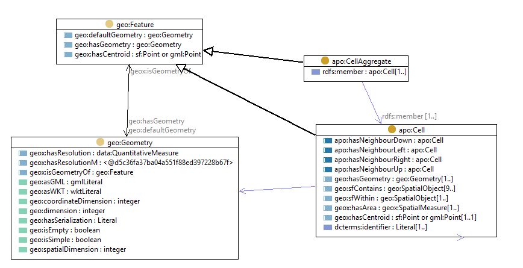

# AusPIX Ontology
Markdown documentation created by [pyLODE](http://github.com/rdflib/pyLODE)

## Metadata
* **IRI**
  * `http://linked.data.gov.au/def/auspix`
* **Creators(s)**
  * <a href="https://orcid.org/0000-0002-3884-3420">Simon J D Cox</a> (<a href="mailto:simon.cox@csiro.au">simon.cox@csiro.au</a>) of <a href="https://ror.org/03qn8fb07">CSIRO</a>
* **Created**
  * 2020-02-05
* **Modified**
  * 2020-05-11
* **Imports**
  * <a href="http://linked.data.gov.au/def/geox">http://linked.data.gov.au/def/geox</a>
* **Ontology RDF**
  * <a href="auspix.ttl">RDF (turtle)</a>
### Description

An ontology to allow AusPIX objects to be linked into Loc-I. 

Two classes are defined: a <code>AusPIX Geometry</code> is composed of one or more <code>AusPIX Cells</code>. 

An AusPIX Geometry is a kind of geometry that may be the object of the <code>hasGeometry</code> property of a Loc-I Feature. 

## Table of Contents
1. [Classes](#classes)
1. [Object Properties](#objectproperties)
1. [Namespaces](#namespaces)  

## Overview

**Figure 1:** Ontology overview  
## Classes
[auspix Cell](#auspixCell),
[auspix Geometry](#auspixGeometry),
### AusPIX Cell c
Property | Value
--- | ---
IRI | `http://linked.data.gov.au/def/auspix#Cell`
Description | Cell, from [AusPIX](https://github.com/GeoscienceAustralia/AusPIX-auspix-dataset)  Individual cells should be refered to using an IRI, typically a call to the AusPIX service.
Super-classes |<a href="http://www.opengis.net/ont/geosparql#SpatialObject">geo:SpatialObject</a>c 
Restrictions |<a href="http://www.opengis.net/ont/geosparql#sfWithin">geo:sfWithin</a> min 1 <a href="http://linked.data.gov.au/def/geox#hasCentroid">geox:hasCentroid</a> exactly 1 <a href="#hasneighbourupward">apo:hasNeighbourUp</a>op only <a href="#auspixCell">apo:Cell</a>c <a href="http://www.opengis.net/ont/geosparql#hasGeometry">geo:hasGeometry</a> min 1 <a href="http://linked.data.gov.au/def/geox#hasArea">geox:hasArea</a> min 1 <a href="#hasneighbourtotheleft">apo:hasNeighbourLeft</a>op only <a href="#auspixCell">apo:Cell</a>c <a href="http://purl.org/dc/terms/identifier">dcterms:identifier</a> min 1 <a href="#hasneighbourdownward">apo:hasNeighbourDown</a>op only <a href="#auspixCell">apo:Cell</a>c <a href="http://www.opengis.net/ont/geosparql#sfContains">geo:sfContains</a> min 9 <a href="#hasneighbourtotheright">apo:hasNeighbourRight</a>op only <a href="#auspixCell">apo:Cell</a>c 
### AusPIX Geometry c
Property | Value
--- | ---
IRI | `http://linked.data.gov.au/def/auspix#Geometry`
Description | A auspix Geometry is composed of a set of auspix Cells
Super-classes |<a href="http://www.opengis.net/ont/geosparql#Geometry">geo:Geometry</a>c 
Restrictions |<a href="http://www.w3.org/2000/01/rdf-schema#member">rdfs:member</a> only <a href="#auspixCell">apo:Cell</a>c <a href="http://www.w3.org/2000/01/rdf-schema#member">rdfs:member</a> min 1 

## Object Properties
[has neighbour downward](hasneighbourdownward),
[has neighbour to the left](hasneighbourtotheleft),
[has neighbour to the right](hasneighbourtotheright),
[has neighbour upward](hasneighbourupward),

### has neighbour downward op
Property | Value
--- | ---
IRI | `http://linked.data.gov.au/def/auspix#hasNeighbourDown`
Super-properties |<a href="http://www.opengis.net/ont/geosparql#sfTouches">geo:sfTouches</a> 

### has neighbour to the left op
Property | Value
--- | ---
IRI | `http://linked.data.gov.au/def/auspix#hasNeighbourLeft`
Super-properties |<a href="http://www.opengis.net/ont/geosparql#sfTouches">geo:sfTouches</a> 

### has neighbour to the right op
Property | Value
--- | ---
IRI | `http://linked.data.gov.au/def/auspix#hasNeighbourRight`
Super-properties |<a href="http://www.opengis.net/ont/geosparql#sfTouches">geo:sfTouches</a> 

### has neighbour upward op
Property | Value
--- | ---
IRI | `http://linked.data.gov.au/def/auspix#hasNeighbourUp`
Super-properties |<a href="http://www.opengis.net/ont/geosparql#sfTouches">geo:sfTouches</a> 

## Namespaces
* **default (:)**
  * `http://linked.data.gov.au/def/auspix#`
* **apo**
  * `http://linked.data.gov.au/def/auspix#`
* **data**
  * `http://linked.data.gov.au/def/datatype/`
* **dcterms**
  * `http://purl.org/dc/terms/`
* **geo**
  * `http://www.opengis.net/ont/geosparql#`
* **geox**
  * `http://linked.data.gov.au/def/geox#`
* **owl**
  * `http://www.w3.org/2002/07/owl#`
* **rdf**
  * `http://www.w3.org/1999/02/22-rdf-syntax-ns#`
* **rdfs**
  * `http://www.w3.org/2000/01/rdf-schema#`
* **sdo**
  * `http://schema.org/`
* **skos**
  * `http://www.w3.org/2004/02/skos/core#`
* **xml**
  * `http://www.w3.org/XML/1998/namespace`
* **xsd**
  * `http://www.w3.org/2001/XMLSchema#`

## Legend
* Classes: c
* Object Properties :op
* Functional Properties: fp
* Data Properties: dp
* Annotation Properties: dp
* Properties: p
* Named Individuals: ni
