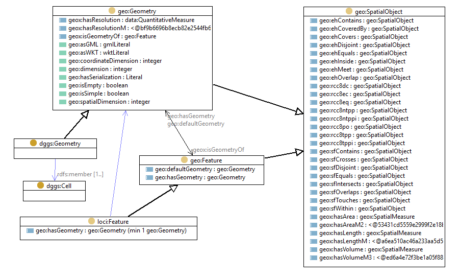

# DGGS Ontology
Markdown documentation created by [pyLODE](http://github.com/rdflib/pyLODE)

## Metadata
* **IRI**
  * `http://linked.data.gov.au/def/dggs`
* **Creators(s)**
  * <a href='https://orcid.org/0000-0002-3884-3420'>Simon J D Cox, CSIRO</a>
* **Created**
  * 2020-02-05
* **Modified**
  * 2020-02-05
* **Imports**
  * <a href="http://linked.data.gov.au/def/loci">http://linked.data.gov.au/def/loci</a>
* **Ontology Source**
  * <a href="dggs.ttl">RDF (turtle)</a>
### Description

An ontology to allow DGGS objects to be linked into Loc-I

## Table of Contents
1. [Classes](#classes)
1. [Namespaces](#namespaces)  

## Overview

**Figure 1:** Ontology overview  
## Classes
[DGGS Cell](#DGGSCell),
[DGGS Geometry](#DGGSGeometry),
### DGGS Cell c
Property | Value
--- | ---
IRI | `http://linked.data.gov.au/def/dggs#Cell`
Super-classes |<a href="http://www.opengis.net/ont/geosparql#Geometry">http://www.opengis.net/ont/geosparql#Geometry</a>c 
### DGGS Geometry c
Property | Value
--- | ---
IRI | `http://linked.data.gov.au/def/dggs#Geometry`
Description | A DGGS Geometry is composed of a set of DGGS Cells
Super-classes |<a href="http://www.opengis.net/ont/geosparql#Geometry">http://www.opengis.net/ont/geosparql#Geometry</a>c 
Restrictions |<a href="http://www.w3.org/2000/01/rdf-schema#member">rdfs:member</a> only <a href="#DGGSCell">dggs:Cell</a>c <a href="http://www.w3.org/2000/01/rdf-schema#member">rdfs:member</a> min 1 

## Namespaces
* **default (:)**
  * `http://linked.data.gov.au/def/dggs#`
* **dcterms**
  * `http://purl.org/dc/terms/`
* **dggs**
  * `http://linked.data.gov.au/def/dggs#`
* **loci**
  * `http://linked.data.gov.au/def/loci#`
* **owl**
  * `http://www.w3.org/2002/07/owl#`
* **rdf**
  * `http://www.w3.org/1999/02/22-rdf-syntax-ns#`
* **rdfs**
  * `http://www.w3.org/2000/01/rdf-schema#`
* **wgs84**
  * `http://www.w3.org/2003/01/geo/wgs84_pos#`
* **xml**
  * `http://www.w3.org/XML/1998/namespace`
* **xsd**
  * `http://www.w3.org/2001/XMLSchema#`

## Legend
* Classes: c
* Object Properties :op
* Functional Properties: fp
* Data Properties: dp
* Annotation Properties: dp
* Properties: p
* Named Individuals: ni